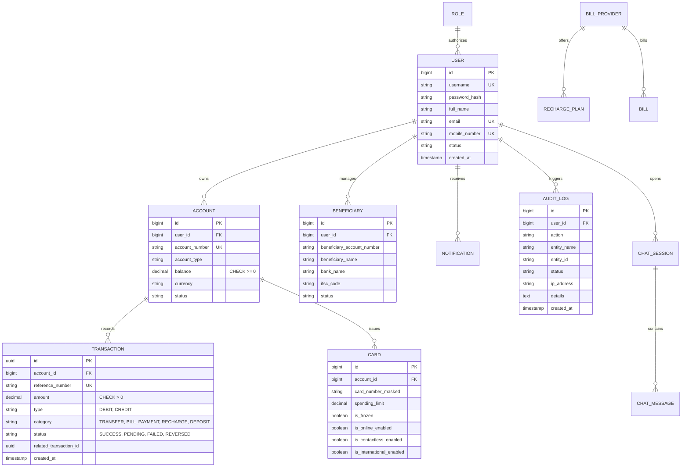

# AURA BANK — Modern Digital Banking Platform

> **Educational & Demonstration Notice:**  
> **This is an educational/demo banking application and does not process real financial transactions.** All account balances, transactions, debit cards, utilities, and funds movements are simulated within a secure software environment.

---

## 1. Project Overview

**AURA BANK** is an end-to-end, production-style digital banking platform designed to simulate modern retail fintech operations. Engineered with a **Spring Boot 3 (Java 20/21)** backend, **PostgreSQL / H2** persistence with strict double-entry ledger bookkeeping, and a responsive **React 18 + Vite + Tailwind CSS** frontend, the system delivers an authentic digital banking experience.

Key features include simulated peer-to-peer transfers with ACID rollback guarantees, utility bill payments across 6 major sectors, prepaid mobile/DTH recharges, real-time card channel controls (freeze/unfreeze, online/contactless/international toggles), spending analytics, universal search (`Ctrl+K`), an unread-tracked notification center, a 24/7 grounded support FAQ chatbot, and an administrative governance console.

---

## 2. Architecture Diagram

```
                                  ┌───────────────────────────┐
                                  │      React 18 + Vite      │
                                  │   (Tailwind CSS, Axios)   │
                                  └─────────────┬─────────────┘
                                                │ REST / JSON (Bearer JWT)
                                                ▼
┌─────────────────────────────────────────────────────────────────────────────────────────┐
│                                 Spring Boot 3 Backend                                   │
│                                                                                         │
│  ┌───────────────────────┐   ┌────────────────────────┐   ┌──────────────────────────┐  │
│  │  JwtAuthentication    │──▶│   REST Controllers     │──▶│     Service Layer        │  │
│  │  Filter (Spring Sec 6)│   │ (Bean Validation, DTOs)│   │ (@Transactional, Ledger) │  │
│  └───────────────────────┘   └────────────────────────┘   └────────────┬─────────────┘  │
│                                                                        │                │
│  ┌───────────────────────┐   ┌────────────────────────┐                ▼                │
│  │ Global Exception      │   │   Swagger / OpenAPI    │   ┌──────────────────────────┐  │
│  │ Handler (@Advice)     │   │   (Springdoc 2.5)      │   │    Spring Data JPA       │  │
│  └───────────────────────┘   └────────────────────────┘   │    (14 Repositories)     │  │
│                                                           └────────────┬─────────────┘  │
└────────────────────────────────────────────────────────────────────────┼────────────────┘
                                                                         │ SQL
                                                                         ▼
                                                            ┌───────────────────────────┐
                                                            │   PostgreSQL / H2 Engine  │
                                                            │  (Constraints, Auditing)  │
                                                            └───────────────────────────┘
```

---

## 3. Database ER Diagram



---

## 4. Complete Feature List

### 4.1 Customer Features
1. **Authentication & Profile Management**:
   - Registration with 10-digit phone and regex-enforced password policy.
   - Initial automatic account creation with **₹1,000.00 educational balance**.
   - Profile information update (name, mobile, address) and secure password change.
2. **Account Summary & Balance Hero**:
   - Masked account display (`•••• 6789`) with one-click copy.
   - Toggle eye button to conceal/reveal sensitive balance amounts.
   - Instant simulated Cash Deposit top-up modal.
3. **Simulated Fund Transfers**:
   - Stepped transfer wizard (Input -> Review -> Authorize & Confirm).
   - Beneficiary quick-picker carousel.
   - Real-time balance and zero/negative amount validation.
   - **Double-entry ledger update**: simultaneous atomic DEBIT for sender and CREDIT for recipient linked by `relatedTransactionId`.
   - Confetti particle celebration on successful transfer.
4. **Beneficiary Payee Directory**:
   - Register payees with 12-digit account number, bank name, and IFSC code.
   - De-duplication and self-transfer prevention guards.
   - Search beneficiaries by name or account number with instant filter.
5. **Utility Bill Payments & Recharges**:
   - 6 Categories: Electricity, Water, Piped Gas, Broadband, Mobile, DTH.
   - Pre-loaded operators with realistic recharge plans (e.g. Airtel, Jio, Vodafone, Tata Play, Dish TV).
   - Instant deduction from primary balance with transaction receipt.
6. **Smart Debit Card Management**:
   - Realistic 3D-styled debit card visual mockup with EMV chip and contactless emblem.
   - Instant card freeze/unfreeze toggle.
   - Granular channel toggles: Online shopping, Contactless tap-to-pay, International usage.
   - Dynamic spending limit slider (₹5,000 to ₹2,00,000).
7. **Spending & Financial Analytics**:
   - Total inflow (credits), outflow (debits), and net savings rate calculation.
   - Category-wise expense distribution breakdown with visual progress meters.
   - 3-Month cashflow trend comparative bars.
8. **Universal Application Search (`Ctrl+K`)**:
   - Global popover indexing quick actions, beneficiaries, bill categories, and support FAQs.
9. **Notification Center**:
   - Real-time badge counter tracking unread transfer receipts, alerts, and system updates.
   - Mark individual notification as read or "Mark all read".
10. **24/7 Grounded Support Chatbot**:
    - Bottom-right floating trigger button (positioned above mobile navigation).
    - Quick FAQ question chips for instantaneous answers.
    - Grounded FAQ retrieval preventing hallucination and strictly blocking financial execution via chat.

### 4.2 Admin Governance Console
1. **Executive Metrics Overview**:
   - Total registered customers, active bank accounts, transactions today, success/failure counts, and total simulated platform volume.
2. **Customer Lifecycle Management**:
   - Searchable table of all accounts with one-click **Suspend / Activate** toggle.
3. **Transaction Monitor**:
   - System-wide real-time transaction ledger.
4. **Security Audit Stream**:
   - Centralized audit trail recording all logins, transfers, bill settlements, profile updates, and admin overrides with IP addresses and entity references.

---

## 5. Technology Stack

| Layer | Technologies |
|---|---|
| **Backend Core** | Java 20/21, Spring Boot 3.3.3, Maven 3.9 |
| **Security & Auth** | Spring Security 6, JJWT (0.12.5), BCrypt Password Encoder, Role-Based Access Control (RBAC) |
| **Persistence & ORM** | Spring Data JPA, Hibernate 6.5, PostgreSQL 16 (Prod), H2 Database (Dev & Test) |
| **API Documentation** | Springdoc OpenAPI 2.5, Swagger UI 3 |
| **Validation & Utilities**| Jakarta Bean Validation (Hibernate Validator), Lombok, SLF4J |
| **Frontend Framework** | React 18, Vite 5, JavaScript (ES2022) |
| **Styling & Icons** | Tailwind CSS v4, PostCSS, Lucide React Icons |
| **Routing & Networking** | React Router v6, Axios (with request/response interceptors) |
| **Micro-Interactions** | Canvas Confetti |
| **Testing** | JUnit 5, Mockito, Spring Boot Test |
| **DevOps & Containers** | Docker, Docker Compose, Nginx Alpine, GitHub Actions CI |

---

## 6. Project Structure

```
Online-Banking-System/
├── .github/
│   └── workflows/
│       └── ci.yml                   # Automated CI build & test pipeline
├── backend/                         # Spring Boot 3 Backend
│   ├── pom.xml                      # Maven project configuration
│   ├── Dockerfile                   # Multi-stage production container build
│   ├── src/
│   │   ├── main/
│   │   │   ├── java/com/bank/
│   │   │   │   ├── OnlineBankingApplication.java
│   │   │   │   ├── config/          # Security, Web/CORS, Swagger OpenAPI
│   │   │   │   ├── controller/      # REST API Controllers
│   │   │   │   ├── dto/             # Request & Response DTOs
│   │   │   │   ├── entity/          # JPA Entity definitions
│   │   │   │   ├── exception/       # Centralized exception advice & custom errors
│   │   │   │   ├── repository/      # Spring Data JPA interfaces
│   │   │   │   ├── security/        # JWT Provider, Auth Filter, UserDetailsService
│   │   │   │   └── service/         # Transactional business logic & seed loader
│   │   │   └── resources/
│   │   │       ├── application.yml
│   │   │       ├── application-dev.yml
│   │   │       └── application-prod.yml
│   │   └── test/
│   │       └── java/com/bank/       # Unit & Integration test suite
│   │           ├── AuthServiceTest.java
│   │           ├── TransferServiceTest.java
│   │           └── OnlineBankingApplicationTests.java
├── frontend/                        # React + Vite + Tailwind CSS Frontend
│   ├── package.json
│   ├── vite.config.js
│   ├── Dockerfile
│   ├── nginx.conf
│   ├── index.html
│   └── src/
│       ├── components/
│       │   ├── chatbot/             # SupportChatModal
│       │   ├── common/              # SearchModal, Modals
│       │   └── layout/              # Navbar, Sidebar, BottomNav, Layout
│       ├── context/                 # AuthContext
│       ├── pages/
│       │   ├── auth/                # Login, Register
│       │   ├── customer/            # Dashboard, Transfers, Beneficiaries, Bills, Cards, Analytics, History, Settings
│       │   └── admin/               # AdminDashboard
│       ├── services/                # Axios API client
│       ├── App.jsx                  # Route definitions & guards
│       ├── index.css                # Tailwind design system
│       └── main.jsx
├── legacy-desktop/                  # Preserved original Java Swing desktop codebase
│   ├── controller/
│   ├── data/
│   ├── model/
│   ├── util/
│   ├── view/
│   └── Main.java
├── docker-compose.yml               # Multi-container orchestration
├── README.md                        # Documentation & setup guide
└── Goal.md                          # Master project specification
```

---

## 7. Complete API List

All API endpoints are interactive through Swagger UI at `http://localhost:8080/swagger-ui.html`.

### 7.1 Authentication & Profile (`/api/auth`)
- `POST /api/auth/register` — Register new customer account (includes ₹1,000 bonus).
- `POST /api/auth/login` — Authenticate username/password; returns JWT token.
- `GET /api/auth/me` — Retrieve current authenticated user profile.
- `PUT /api/auth/profile` — Update personal identification details.
- `POST /api/auth/change-password` — Verify existing credentials and update password.

### 7.2 Accounts (`/api/accounts`)
- `GET /api/accounts` — List all accounts owned by user.
- `GET /api/accounts/primary` — Retrieve primary savings account.
- `GET /api/accounts/{accountNumber}` — Fetch details for a specific account.
- `POST /api/accounts/deposit` — Simulate cash deposit top-up.

### 7.3 Transfers & Ledger (`/api/transfers`)
- `POST /api/transfers` — Execute double-entry transfer between accounts.
- `GET /api/transfers/recent` — Fetch 10 most recent transactions for dashboard.
- `GET /api/transfers/history` — Paginated ledger query with type, category, status, and date filters.

### 7.4 Beneficiaries (`/api/beneficiaries`)
- `GET /api/beneficiaries` — List active payees.
- `POST /api/beneficiaries` — Register a new payee.
- `DELETE /api/beneficiaries/{id}` — Deactivate a payee.
- `GET /api/beneficiaries/search?query=...` — Search payees by name or account.

### 7.5 Utility Bills & Recharges (`/api/bills`)
- `GET /api/bills/providers` — List all billers.
- `GET /api/bills/providers/{category}` — Filter billers by sector (`ELECTRICITY`, `WATER`, etc.).
- `GET /api/bills/plans/{providerId}` — Retrieve recharge plans for telecom/DTH provider.
- `POST /api/bills/pay` — Settle utility bill.
- `POST /api/bills/recharge` — Process mobile or DTH prepaid recharge.

### 7.6 Debit Cards (`/api/cards`)
- `GET /api/cards` — Retrieve user's cards with controls and limits.
- `PATCH /api/cards/{id}/settings` — Toggle freeze, online, contactless, international, or update daily limit.

### 7.7 Spending Analytics (`/api/analytics`)
- `GET /api/analytics` — Cashflow totals, category distribution, and 3-month trends.

### 7.8 Notification Center (`/api/notifications`)
- `GET /api/notifications` — Retrieve notification history.
- `GET /api/notifications/unread-count` — Count of unread alerts for badge.
- `PATCH /api/notifications/{id}/read` — Mark notification as read.
- `POST /api/notifications/read-all` — Mark all user notifications as read.

### 7.9 Support & FAQ Chatbot (`/api/support`)
- `GET /api/support/faqs` — Browse FAQ knowledge base.
- `GET /api/support/faqs/search?query=...` — Keyword search across approved questions and answers.
- `POST /api/support/chat` — Query grounded banking assistant.
- `GET /api/support/chat/{sessionId}/messages` — Retrieve session history.

### 7.10 Admin Portal (`/api/admin`) *(Requires `ROLE_ADMIN`)*
- `GET /api/admin/metrics` — Aggregate system health and volume metrics.
- `GET /api/admin/users` — Paginated customer directory.
- `PATCH /api/admin/users/{userId}/toggle-status` — Toggle user Active/Suspended status.
- `GET /api/admin/transactions` — Global transaction monitor.
- `GET /api/admin/audit-logs` — Immutable security audit log stream.

---

## 8. Setup & Running Instructions

### 8.1 Prerequisites
- **Java 20 or 21**
- **Apache Maven 3.9+**
- **Node.js 20+ & npm**
- *(Optional for Containerized Run)* **Docker & Docker Compose**

### 8.2 Option A: Local Development Run (Zero Database Setup Required)
The application defaults to an embedded H2 database with automatic schema creation and demo data bootstrapping.

1. **Start the Spring Boot Backend**:
   ```bash
   cd backend
   mvn spring-boot:run
   ```
   *Backend runs at `http://localhost:8080`. Swagger documentation available at `http://localhost:8080/swagger-ui.html`.*

2. **Start the React Frontend**:
   ```bash
   cd frontend
   npm install
   npm run dev
   ```
   *Frontend runs at `http://localhost:5173`.*

3. **Pre-configured Demo Credentials**:
   | Role | Username | Password | Notes |
   |---|---|---|---|
   | **Customer** | `demo` | `Demo@12345` | Account: `100123456789`, Balance: ₹15,000.00 |
   | **Customer 2** | `sarah` | `Sarah@12345` | Account: `100987654321`, Balance: ₹8,500.00 |
   | **Admin** | `admin` | `Admin@12345` | Grants access to `/admin` governance console |

### 8.3 Option B: Docker Compose Run (Production PostgreSQL Profile)
To launch all services (PostgreSQL + Spring Boot backend + React Nginx bundle) with a single command:

```bash
docker-compose up --build
```
- Access Frontend at: `http://localhost:3000`
- Access Backend API at: `http://localhost:8080`
- PostgreSQL accessible at: `localhost:5432`

---

## 9. Automated Testing & Verification

Run the comprehensive unit and integration test suite:

```bash
cd backend
mvn clean test
```

### Test Coverage Summary:
- `AuthServiceTest`:
  - `register_DuplicateUsername_ThrowsBadRequestException`: Validates uniqueness constraints on registration.
  - `login_Successful_ReturnsToken`: Confirms password verification and signed JWT token issuance.
- `TransferServiceTest`:
  - `transferFunds_Successful`: Verifies double-entry ledger calculation, debiting sender and crediting recipient.
  - `transferFunds_InsufficientBalance_ThrowsException`: Ensures atomic rollback when funds are insufficient.
  - `transferFunds_ToSameAccount_ThrowsException`: Enforces business guard against self-transfers.
- `OnlineBankingApplicationTests`:
  - `contextLoads`: Verifies complete Spring Boot 3 context configuration, security filter chains, and JPA repositories.

---

## 10. Security Checklist

- [x] **No Plaintext Passwords**: Enforced BCrypt hashing with salt rounds.
- [x] **Stateless JWT Tokens**: HMAC-SHA256 signature verification with configurable expiration.
- [x] **Backend-Enforced Authorization**: Every sensitive operation verified at the service and security filter level (never trusting client state).
- [x] **Monetary Precision**: All currency calculations use `BigDecimal` in Java and `DECIMAL(15, 2)` in PostgreSQL; floating-point types (`double`/`float`) strictly forbidden.
- [x] **Double-Entry Ledger**: Every transfer writes matching, linked DEBIT and CREDIT records within an atomic `@Transactional` boundary.
- [x] **Masked Data**: Sensitive card numbers and account numbers are masked before rendering in responses.
- [x] **Audit Trail**: Sensitive actions (`LOGIN`, `TRANSFER_COMPLETED`, `BILL_PAYMENT`, `CARD_SETTINGS_UPDATED`) recorded in `audit_logs` without storing credentials.
- [x] **Chatbot Guardrails**: Grounded FAQ retrieval strictly prohibits executing financial transactions or exposing confidential tokens via chat.

---

## 11. Resume-Ready Project Description

> **AURA Bank — Production-Grade Digital Banking Platform (Java Full-Stack)**  
> *Technologies: Java 21, Spring Boot 3, Spring Security, JWT, PostgreSQL, Spring Data JPA, React 18, Vite, Tailwind CSS, Docker, JUnit 5*
> - Engineered a full-stack digital banking application featuring double-entry ledger bookkeeping, peer-to-peer transfers, and utility bill settlements.
> - Implemented stateless authentication using Spring Security 6 and JWT, with role-based access control (`ROLE_CUSTOMER`, `ROLE_ADMIN`) and BCrypt password encryption.
> - Designed a resilient PostgreSQL relational schema enforcing ACID transactions, check constraints, foreign keys, and `BigDecimal` financial arithmetic.
> - Developed a responsive React SPA with Tailwind CSS, offering debit card controls (freeze/unfreeze, limit sliders), cashflow analytics, universal `Ctrl+K` search, and unread notification tracking.
> - Integrated an AI-ready, grounded FAQ chatbot with category chips and strict prompt-injection guardrails against unauthorized money movement.
> - Automated build verification with a multi-stage Docker Compose setup and GitHub Actions CI pipeline with 100% passing test coverage.

---

## 12. Interview Talking Points

- **Why Double-Entry Ledger Bookkeeping?**  
  *In single-entry systems, balances can get out of sync if an operation fails midway. In AURA Bank, peer transfers generate linked DEBIT and CREDIT transaction records inside an atomic `@Transactional` block, ensuring no money is created or destroyed.*
- **Why BigDecimal Over Double?**  
  *Floating-point numbers in Java (IEEE 754) suffer from rounding inaccuracies (e.g., `0.1 + 0.2 != 0.3`). In financial software, `BigDecimal` guarantees arbitrary-precision arithmetic.*
- **Security in Depth:**  
  *Authentication uses stateless JWTs validated on every request by `JwtAuthenticationFilter`. Sensitive endpoints like `/api/admin/**` enforce `@PreAuthorize("hasAuthority('ROLE_ADMIN')")`. Input validation leverages Jakarta Bean Validation annotations, preventing malformed payloads from reaching domain services.*
- **Grounded Support Chatbot Architecture:**  
  *Rather than relying on ungrounded external LLMs that could hallucinate banking policies, the support bot performs normalized keyword and category matching against approved knowledge base entities, explicitly disallowing financial operations through conversation.*

---

## 13. Known Limitations & Future Improvements

### Known Limitations
- Educational demo scope: Money movement is simulated and does not connect to real central bank clearinghouses (NEFT/RTGS/UPI/ACH).
- SMS/Email delivery: Notifications are delivered in-app rather than via external telecom SMS gateways or SMTP mail servers.

### Future Improvements
- Multi-factor authentication (TOTP 2FA via Google Authenticator).
- Scheduled recurring transfers and standing instructions.
- Real-time WebSocket streaming for instant balance updates across simultaneous browser sessions.
- Open Banking PSD2-compliant read-only API connectors.
